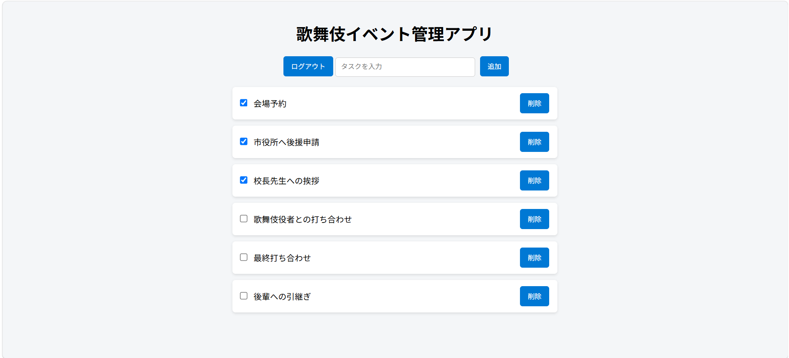

# 歌舞伎イベントマネージャー

大学の歌舞伎イベント運営を想定して作成したタスク管理Webアプリです。  
イベント準備のタスクを整理し、運営を効率化することを目的に制作しました。

## 公開URL
https://ryo-f-dev.github.io/kabuki-event-manager/

## テスト用ログイン情報

ID: admin  
Password: 1234

※ポートフォリオ用の簡易ログイン機能のため、認証はフロントエンドで実装しています。

## アプリ画面

### ログイン画面

### タスク管理画面

ログイン後、イベント準備のタスクを管理する画面です。

## 主な機能
- ログイン画面
- タスク管理機能
- タスクの追加・削除
- JavaScriptによる画面操作

## 使用技術
- HTML
- CSS
- JavaScript
- GitHub
- GitHub Pages

## 制作背景
大学で歌舞伎の普及活動に取り組む中で、イベント準備のタスク管理が煩雑になることを感じました。  
そこで、イベント運営を支える簡易的なタスク管理アプリを作成しました。

## 今後の改善予定
- タスクの保存機能の追加
- UIデザインの改善
- スマートフォン対応
